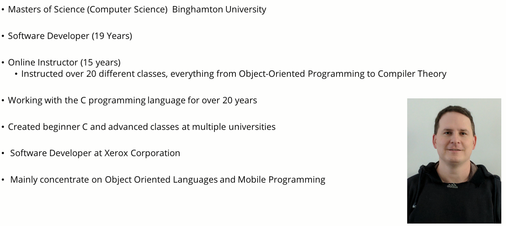

# Welcome to class

- this class is the second class in my series of C programming classes here at Udemy
  - focuses on more intermediate/advanced concepts of C

- first class was "C programming for Beginners"
  - focused on basic C programming concepts

- it is not required to enroll in the first class if you already have basic knowledge of the C programming language

- if you are new to "C" programming, I would suggest that you first enroll in my "C programming for Beginners" class

## Topics

- storage classes
  - auto, register, static, and extern

- advanced data types
  - typedef, variable length arrays, flexible array numbers, complex number types

- type qualifiers
  - const, volatile, and restrict

- bit manipulation
  - binary numbers and bits
  - bitwise operators (logical and shifting)
  - bitmasks and bitfields

- Advanced control flow
  - goto, null, comma operator
  - setjmp and longjmp

- more on Input and Output
  - getchar, putchar, fgets, etc.
  - puts, sprint, fprintf, fflush

- advanced function concepts
  - variadic functions (variable number of arguments)
  - recursive functions
  - inline functions

- unions
  - overview, defining and accessing union members

- advanced preprocessor concepts
  - #define, #pragma, #error, #, ##
  - conditional compilation (#ifdef, #endif, #else, #elif, #undef, etc)
  - include guards

- macros
  - overview (vs. functions, when to use)
  - predefined macros
  - creating your own macros

- advanced debugging and compiler flags
  - debugging with the pre-processor, more on gdb
  - core files, getting the stack trace
  - static analysis and profiling

- static libraries and shared objects
  - overview, creation, dynamic loading

- working with larger programs
  - dividing your program into multiple files and compiling multiple files

- advanced pointers
  - double pointers (pointers to pointers)
  - function pointers
  - more on void pointers

- threads (pthread (posix), not <threads.h> from C11)
  - overview, creating a thread
  - mutexes and semaphores
  - thread management (multi-threading, join, detach)

- networking (unix based using Cygwin)
  - overview (client/server model)
  - creating server and client sockets

- many challenges, solutions, and examples

- organized around theory and many demonstrations

- hands on coding

- you will be able to write advanced C programs

- you will be able to write efficient, high quality C code
  - modular
  - low coupling

- master the art of problem solving in programming using efficient, proven methods

- you will understand advanced concepts of the C Programming language

- you will have fun!