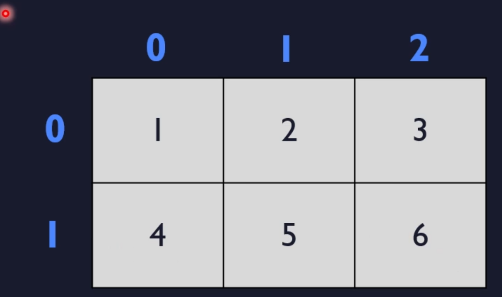
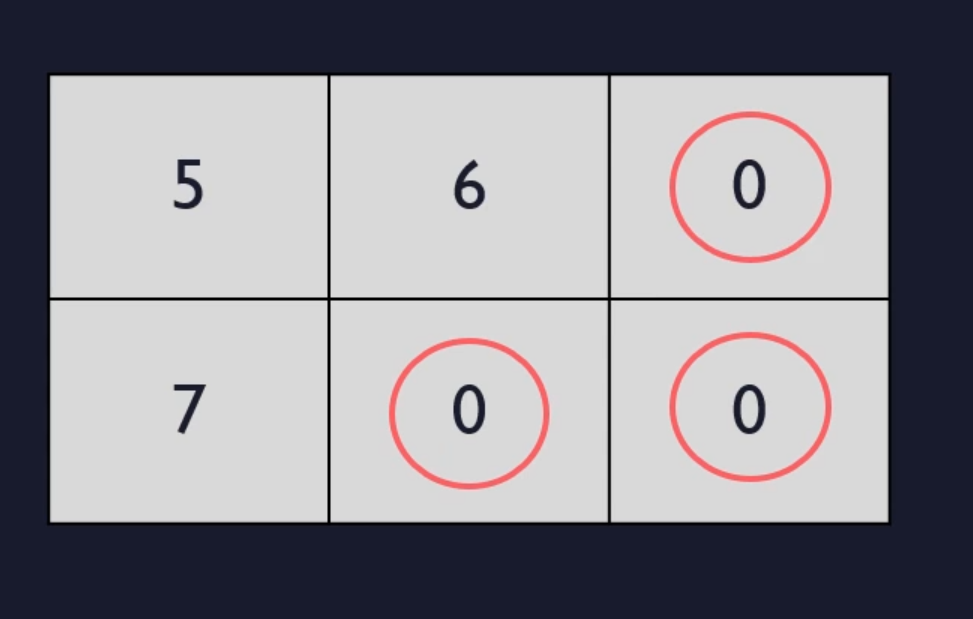
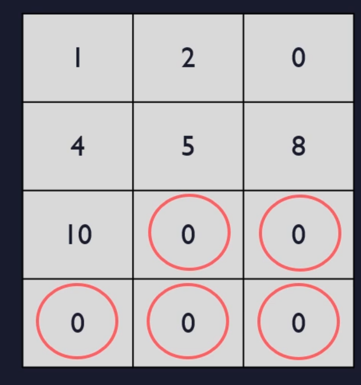
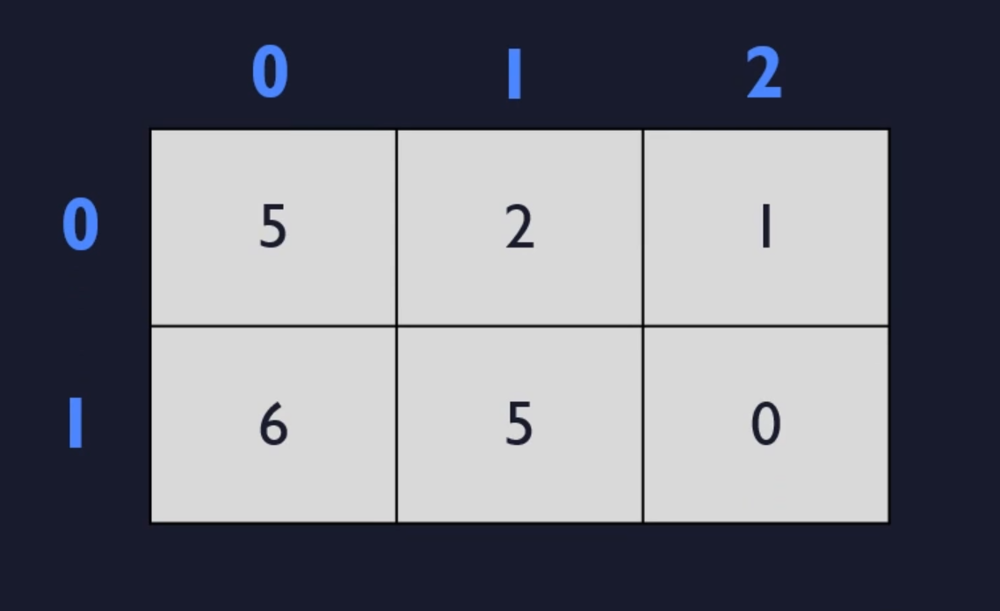

# 2d arrays init


# Standard way

```c
int mat[2][3]={{1,2,3},{4,5,6}}
```



# Incomplete Values in the Internal Curly Brackets

```c
int mat [2][3] ={{5,6}, {7}}
```




```c
int mat [4][3] = {{1,2},{4,5,8},{10}}

```



# Excessively values in the internal curly brackets

```c
int mat[2][3] = {5,2,1,6,5};
```



- we are adding values in that examples from top and then left to right