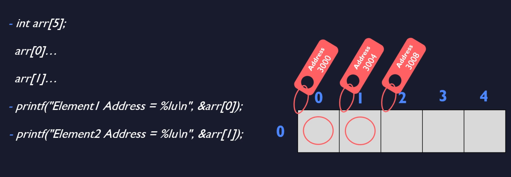
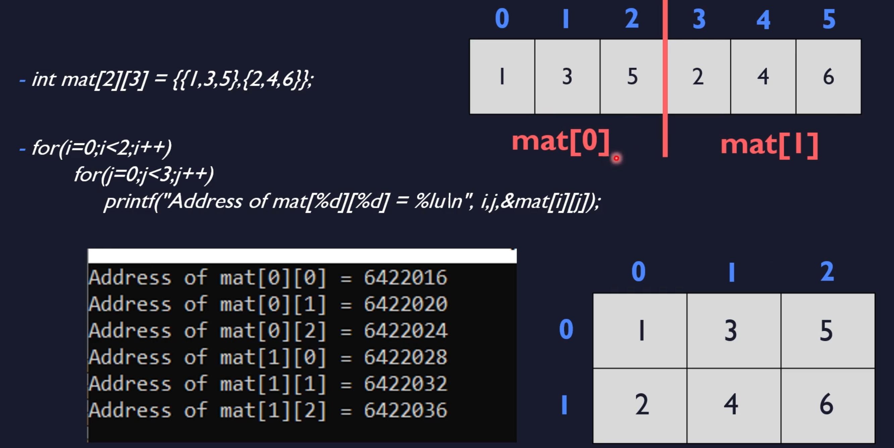

# 2D Arrays - Memory Representation


- 4 bits because every integers consumes 4


my output:
```bash
Element 1 Address = 140726162498448
Element 1 Address = 140726162498452
Element 1 Address = 140726162498456
Element 1 Address = 140726162498460
Element 1 Address = 140726162498464
```

- basically it is sequence - no surprise


