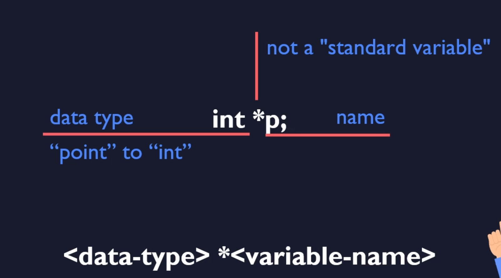
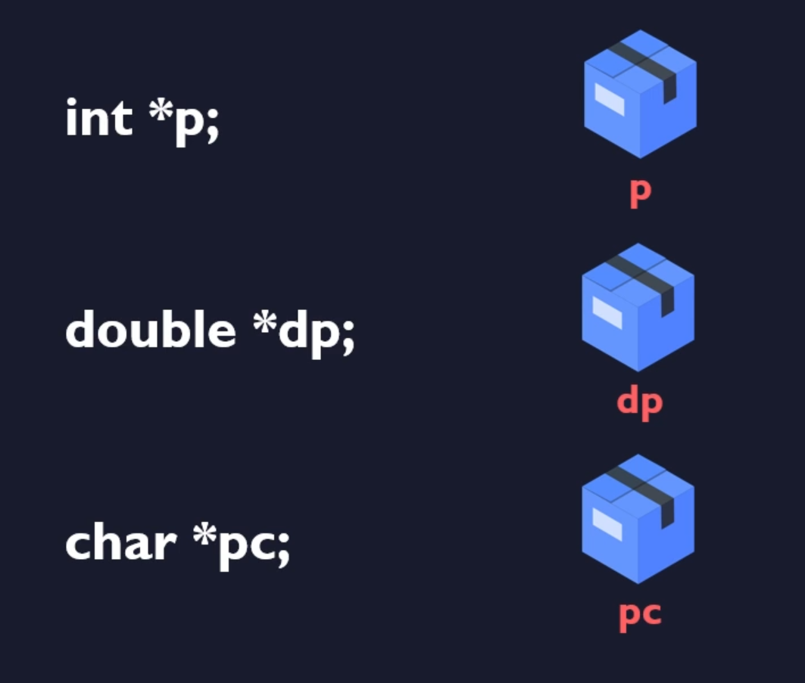
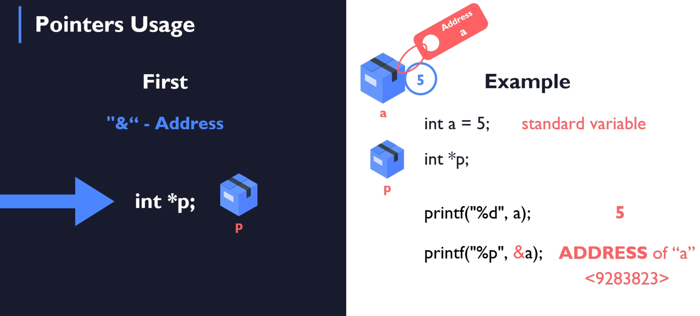
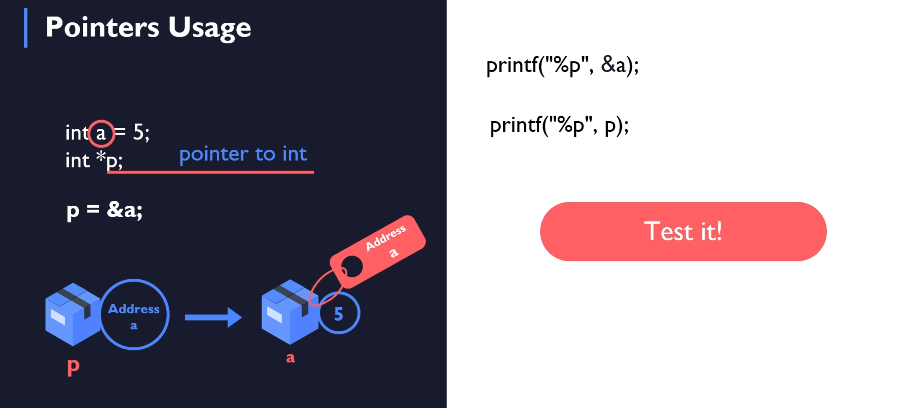
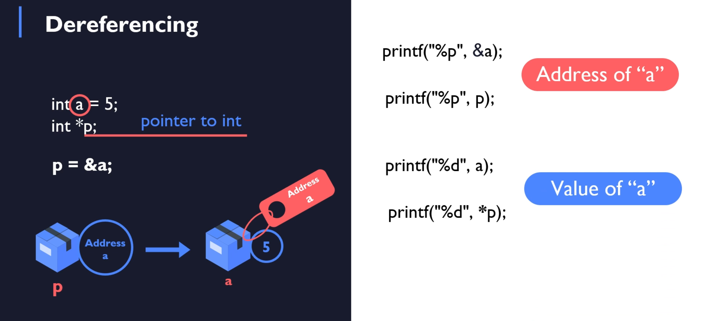

# Pointers - Declaration and usage

## Pointers Declaration

- nothing new

## Pointers usage

- main concept for pointers

## Dereferencing

- usage of `*`
- accessing the address from the pointer, and getting the value from it