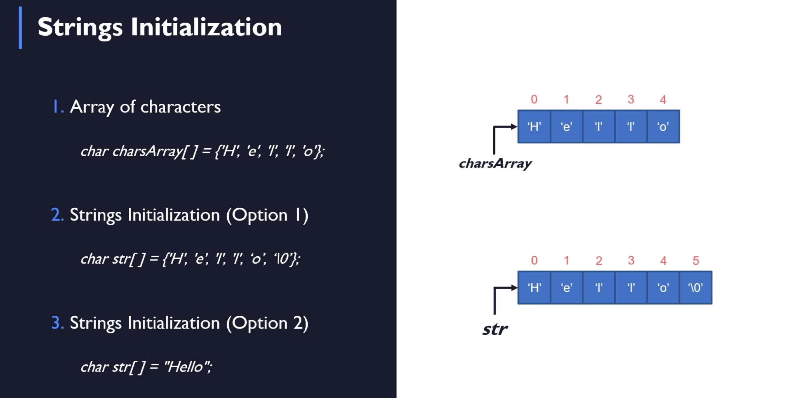
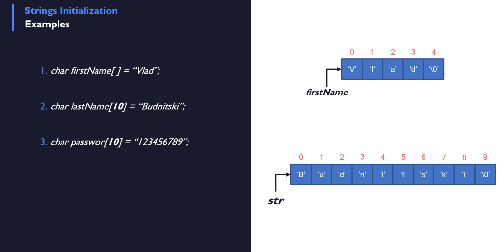

# Strings Initialization

## Array of Characters

- hello in double quote is exactly the same, it is just a different syntax `\0` is still appended.

- note that you need to have extra space for the `\0`

