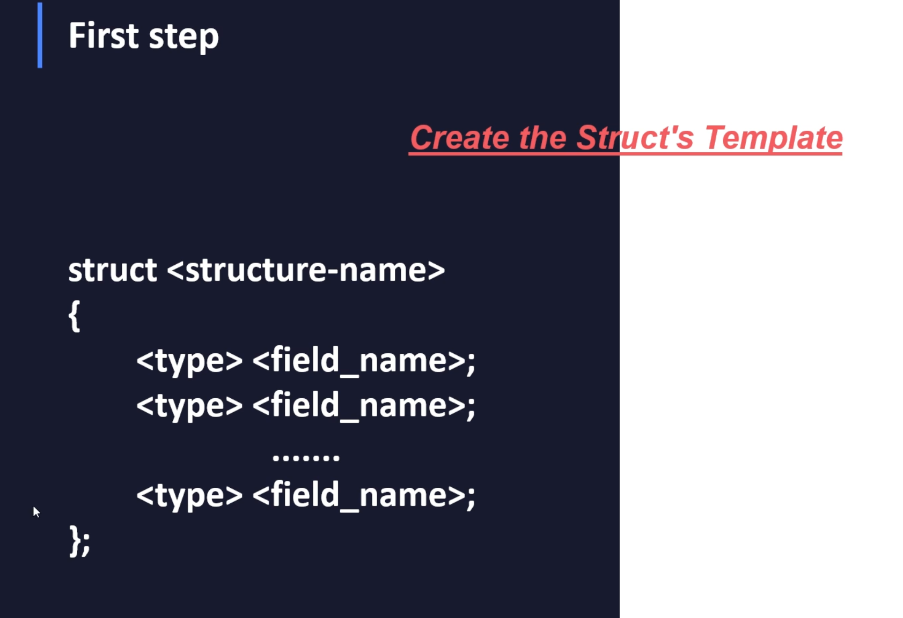
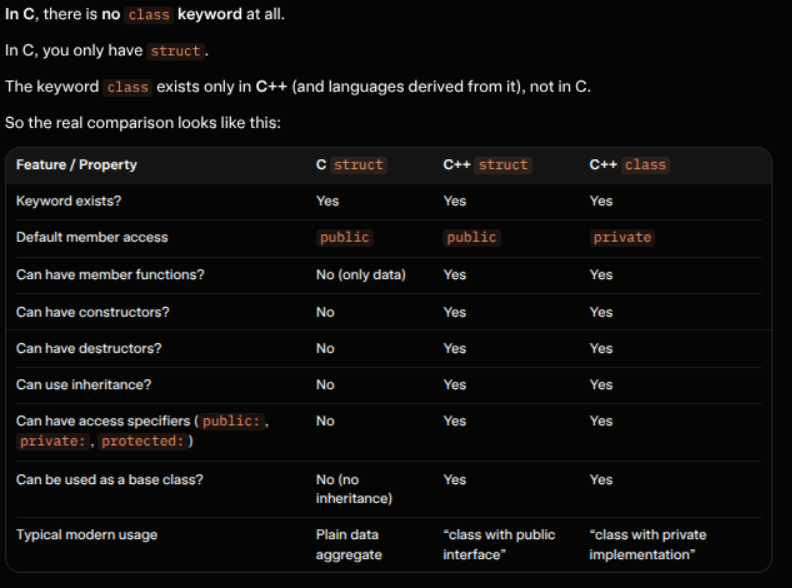

# Creating a structure template

Summary – most important points for someone coming from C

- In C → only struct, only data (no methods, no access control, no constructors, no inheritance)
- In C++ → struct and class are almost identical
- The only real difference is the default access level for members and base classes 
  - struct → defaults to public
  - class → defaults to private

