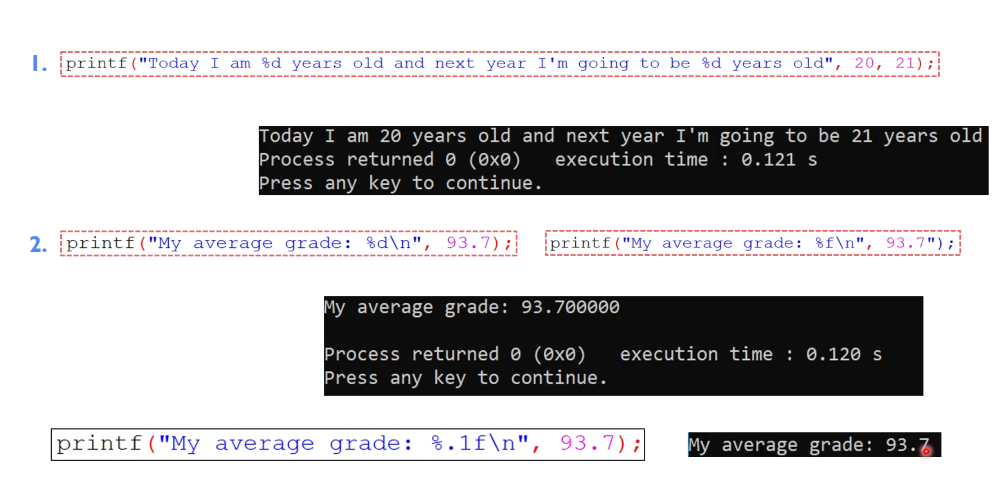

# Format specification

```c
#include <stdio.h>
#include <stdlib.h>

int main()
{
    printf("I am 20 years old\n");
    return 0;
}
```


```c
#include <stdio.h>
#include <stdlib.h>

int main()
{
    printf("I am %d years old\n", 20);
    return 0;
}
```

## Format specifications - examples



