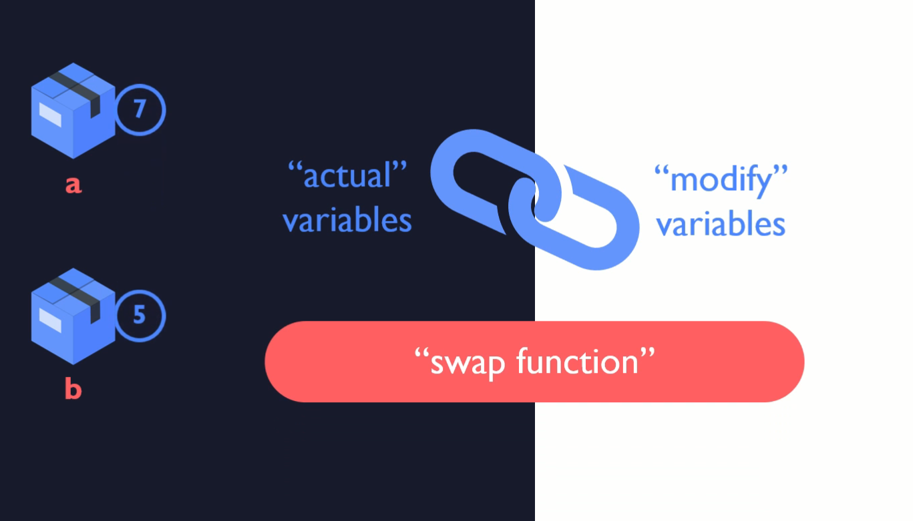

# Declaration and usage of pointers



- it can be achieved by passing addresses / pointers

- Pointer variable stores an `ADDRESS`


Syntax:


```c
// not a standard variable - *
// p - name
int *p;
// data type int
// point to int
```

rule:
- `<data-type> *<variable-name>`


examples:
- `double *dp;`
- `char *pc;`

## Pointer usage

- `&` - address indicator


```c

int a = 5; // standard variable

int *p;

printf("%d", a);

printf("%p", &a); // ADDRESS of `a` <23523565>

// ----
// Pointing p to a
p = &a;
printf("%p", &a);
printf("%p", p);

```


## Dereferencing

```c
printf("%d", *p); // we are going to address and taking the value out


```