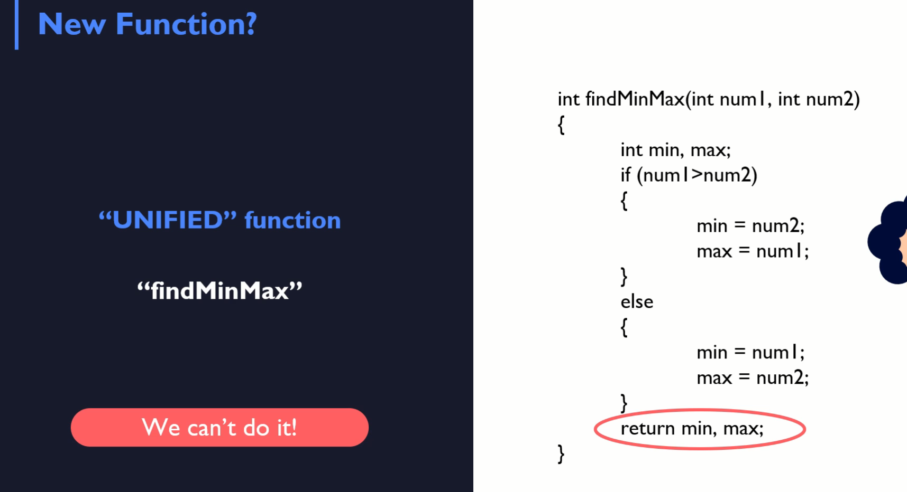

# Exclusive pass by reference guide

## single return - you can not return two values

## Solution - Pointers
- one function - both variables
- to modify by reference - sending addresses to the function and the function that received addresses is going to modify them

