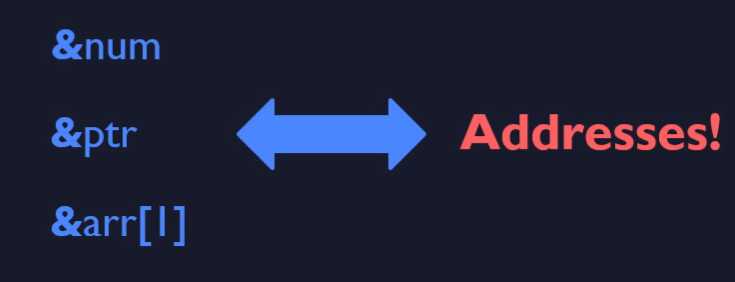

# Quick Summary

1. Operator `&`
   1. every variable has an address
      1. standard variables
      2. pointers variables
   2. The address of every variable can be obtained by using the & operator 

2. Pointer Variables - Pointers
- special variables that hold addresses
- the value assigned to a pointer-variable has to be an address
- assignment of a standard value for example 5 wont work
- you should not make an assignment of an address to a pointer variable that is not of the same type
  - for example char pointer should not point to int

3. Operator `*`
- used for pointer variables
- allow to access the content of the address it points to
