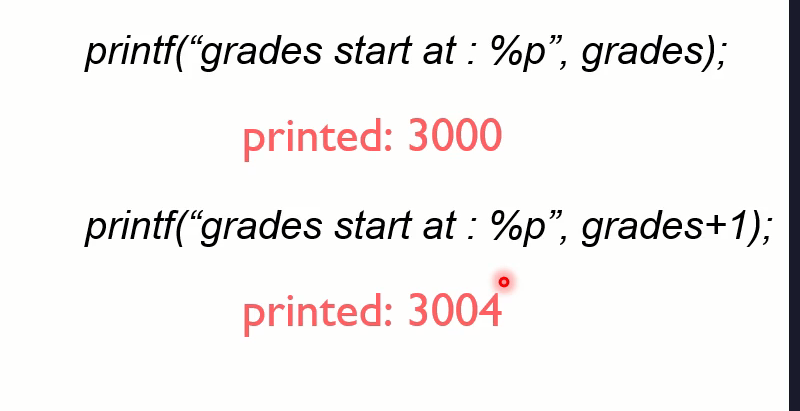

# Pointers arithmetic introduction 

`*` operator it will give us an value of the array

## An example of pointers arithmetic

1. Pointer Arithmetic -> Addresses Arithmetic
- how to add and subtract some value to and from pointer variable
- mathematical operations on pointers

## Pointers Arithmetic
2. addition / subtraction is done n chunks of the size of the data type the pointer in pointing to:
- int
- double
- chat

int *ptr; 3000
ptr = ptr + 1; // 3000 + 1*sizeof(int) = 3000 + 1*4 = 3004