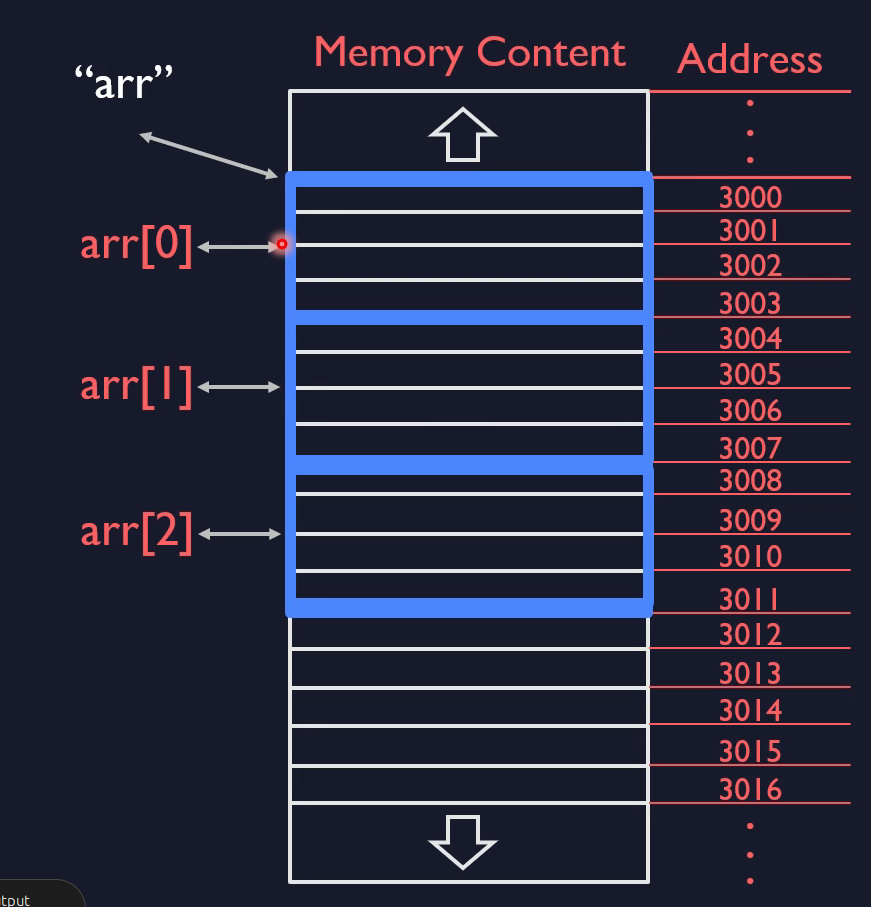

# `sizeof` and static arrays



```c
int count = sizeof(arr) / sizeof(arr[0]); 
// 12 bytes / 4 bytes = 3 elements
```

[!CAUTION]
This "Sizeof Array" trick only works in the same scope where the array is defined. If you pass an array to a function, it "decays" into a pointer, and sizeof will suddenly return the size of the pointer (usually 8 bytes) instead of the array!