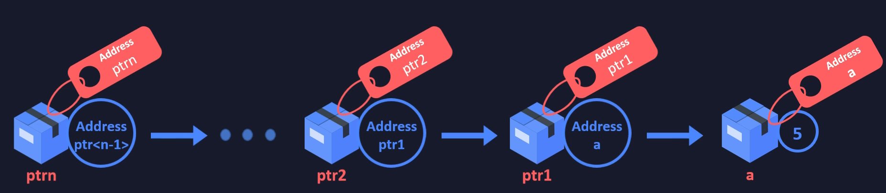

# Multiple Indirection

```c
int a = 5;

int *ptr1 = &a;       // pointer to int

int **ptr2 = &ptr1;   // pointer to pointer to int

int *...*ptrn = &ptr<n-1>;   // "ptr<n-1> is a pointer to pointer (n-1 times) to int"
```

