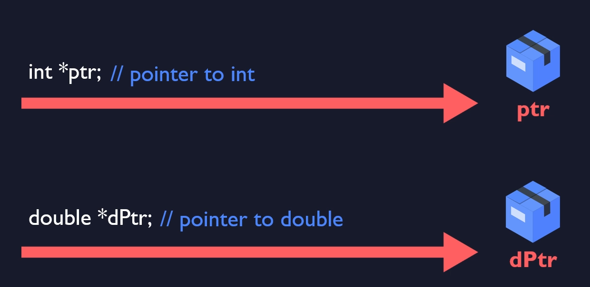
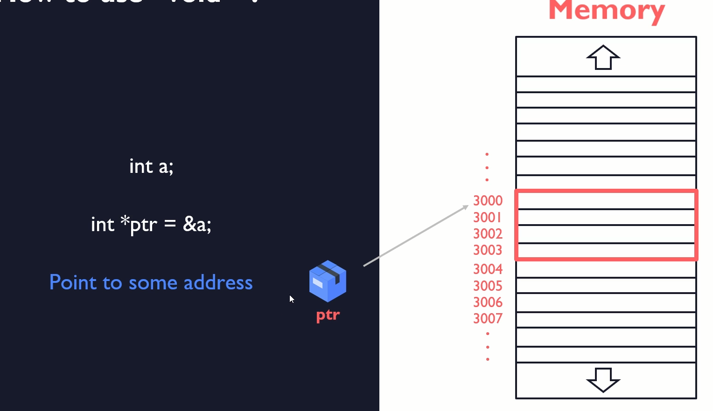
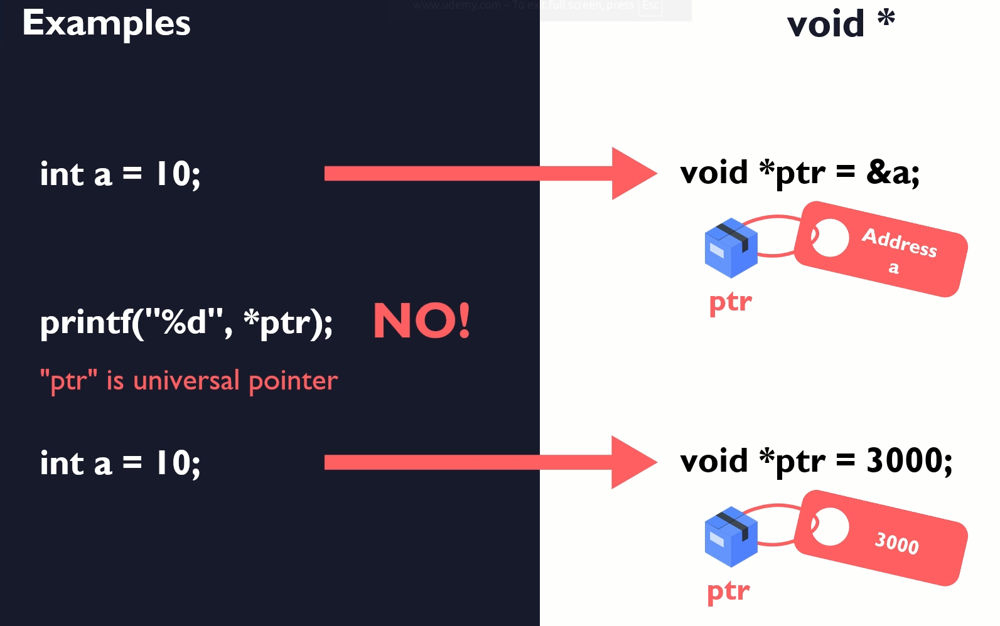
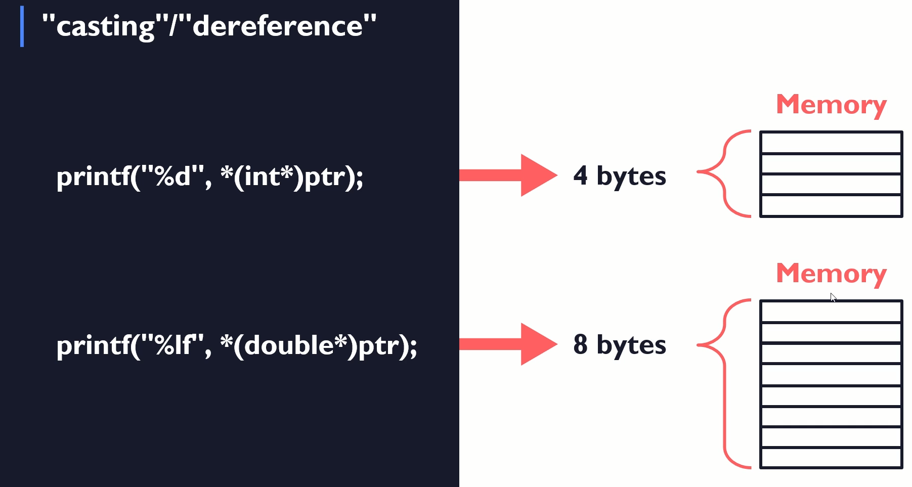

# Universal Pointer Void

## Void Universal approach

`void *` = points to an address of ANY TYPE of data

# Why is it useful
- general purpose functions
  - that providing functionality for many different types (general functionality)
- returned pointer type

# How to use `void*`

- we know to what exactly type of data pointer is pointing so the system knows that important and to grab are only 4 bytes

# Explicit type casting

- this casting is required because system needs to know how many bytes it need to grab

## Casting / Dereference

