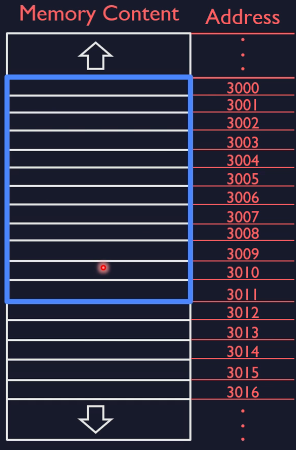
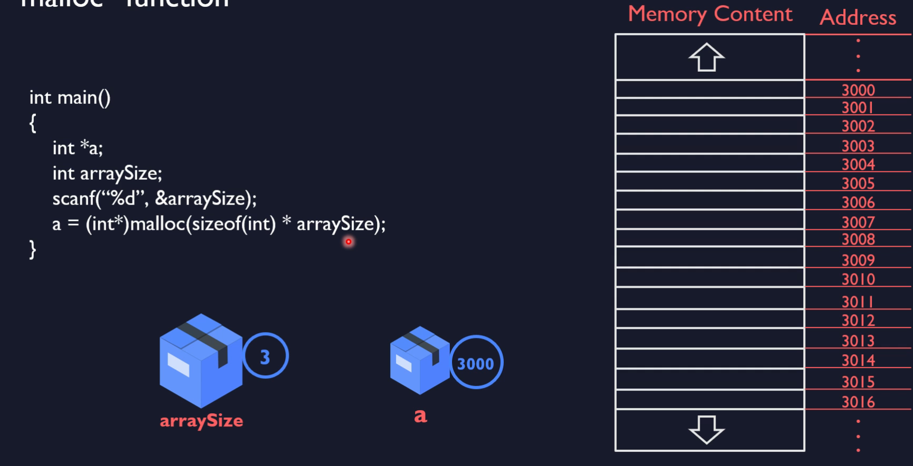
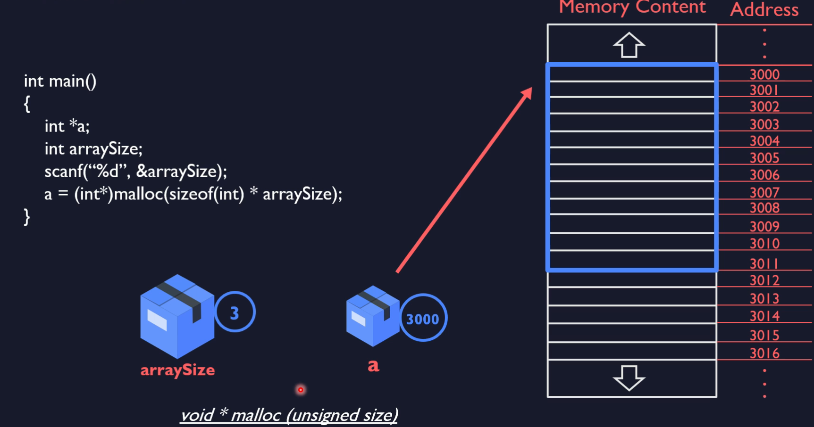

# `malloc` function

1. Allocates a `sequence of bytes`
    - for example 12 bytes
2. Returns the ADDRESS of the sequence
    - the address of the FIRST Byte
    - for example 300
3. can work with allocated sequence


- sequential memory



- we want `malloc` to allocate 12 bytes
- `malloc` return address of the first element



- the method is returning type `void *`


## Checking if allocated results were successful

```c
#include <stdio.h>
#include <stdlib.h>

int main()
{
    double *bArr;
    int arraySize;
    scanf("%d", &arraySize);
    bArr = (double*)malloc(sizeof(double) * arraySize);

    if (bArr != NULL)
        printf("Allocation Succeeded!\n");
    else
        printf("Allocation Failed.\n");

    free(bArr);
    return 0;
}
```