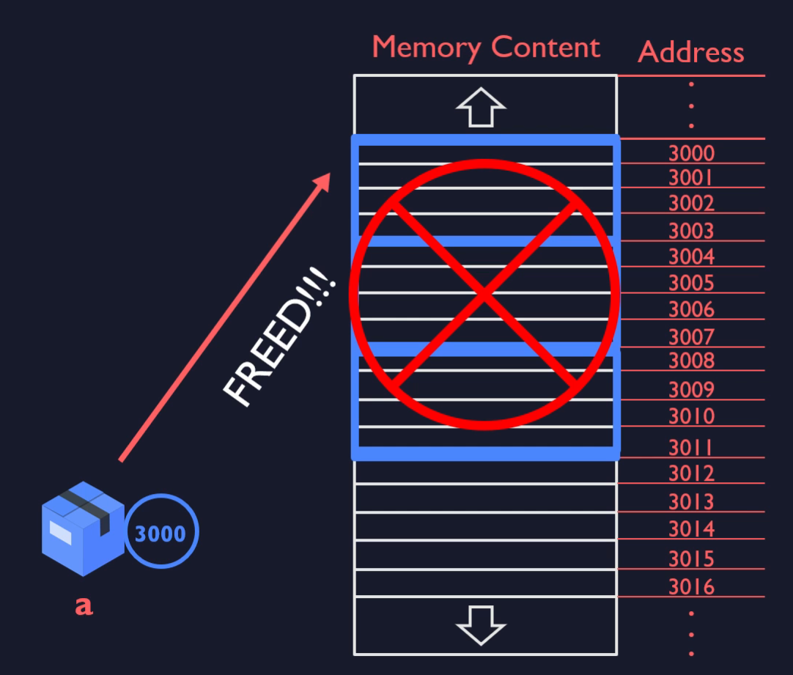

# `free` function

- freed memory that has been allocated



```c
int main()
{
    int *a;
    int arraySize;
    scanf("%d", &arraySize);
    a = (int*)calloc(arraySize, sizeof(int));

    // some code...

    free(a);
}
```

# consideration for using the `free` function

1. Dynamic allocation inside a Function
   - one we leave the function memory is not freed
2. Repeatable Memory Allocation inside a Loop
   - loop and in each iteration you doing some memory allocation so you should as well consider freed memory. 

## 5 Common Errors with using `free` function


1. creating a static array

```c
int a[10]
free(a);  // it is not dynamic array so you can not free it
```

2. you can not free un-allocated memory

```c
int *a;
free(a);

```


3. When you are doing memory allocation and call free twice

```c
int *a;
a = (int*)malloc(sizeof(int)*5);
free(a);
free(a);

```

4. you can not free a part of the system that has been allocated dynamically

```c
int *a;
a = (int*)malloc(sizeof(int)*5);
free(a);
```