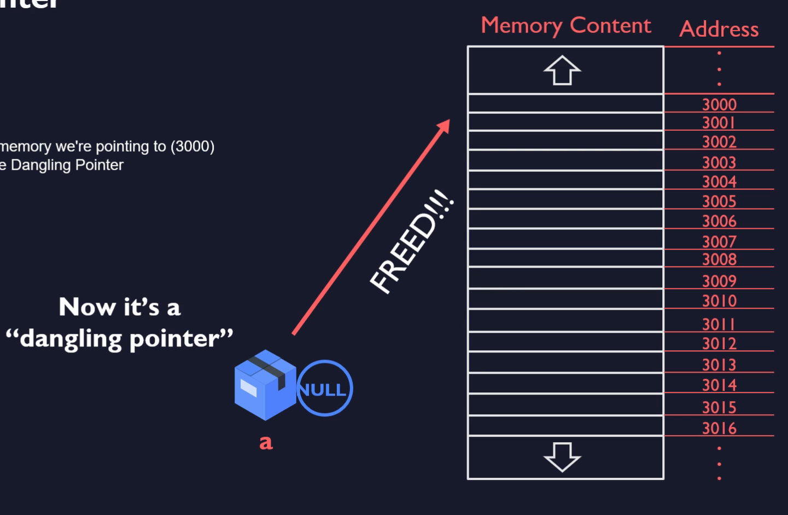

# Dangling Pointer

## dynamically allocated arrays

1. Create a pointer variable
2. allocate some memory at run time
3. assign allocated address to the pointer
4. work with the array
5. free the memory


best solution:
- set the pointer to the null (that it is pointing to null)

```c
free(a);        // frees the real memory we are pointing to (3000)
a = NULL;       // Disabling the dangling pointer
```

