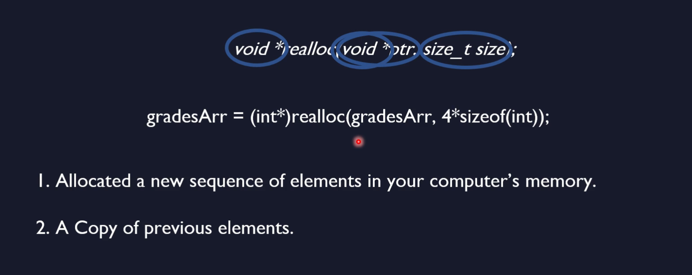

# `realloc` function


## we have learned so far
- malloc
- calloc
- free

## An Example


```c
int *gradesArray;
int i, totalGrades;
scanf("%d", &totalGrades);
gradesArray = (int*)malloc(sizeof(int) * totalGrades);
if(gradesArray != NULL)
    printf("Allocation Succeded!\n");
else
{
    printf("Allocation Failed.\n");
    exit(1);
}
for (i=0; i<totalGrades; i++)
{
    printf("Enter Grade %d: ", i+1);
    scanf("%d", &gradesArray[i]);
}

```

## with a re-allocate


```c
int* reallocate(int *oldArr, int oldSize, int newSize)
{
    int i;
    int *newArr;
    newArr = (int*)malloc(newSize * sizeof(int));
    for(i=0; i<oldSize; i++)
    {
        newArr[i] = oldArr[i];
    }
    free(oldArr);
    return newArr;
}

```

